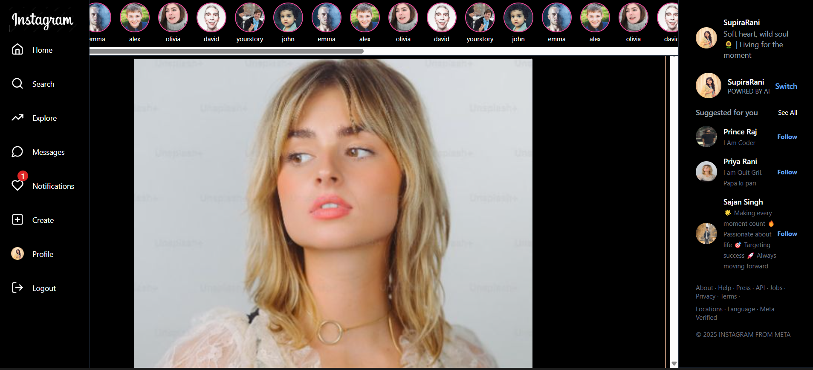
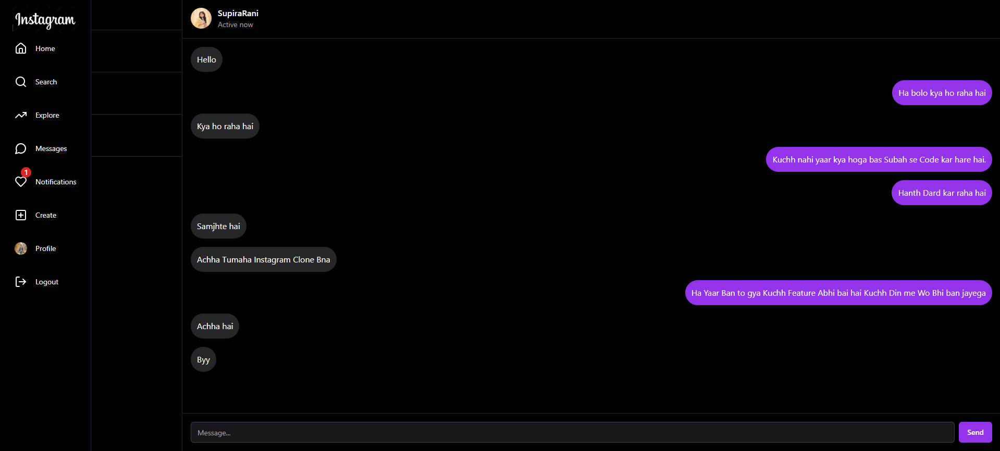
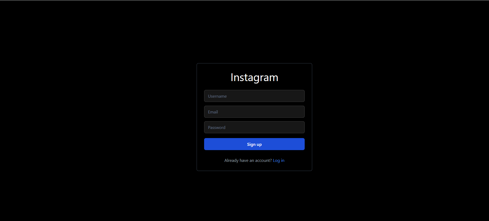
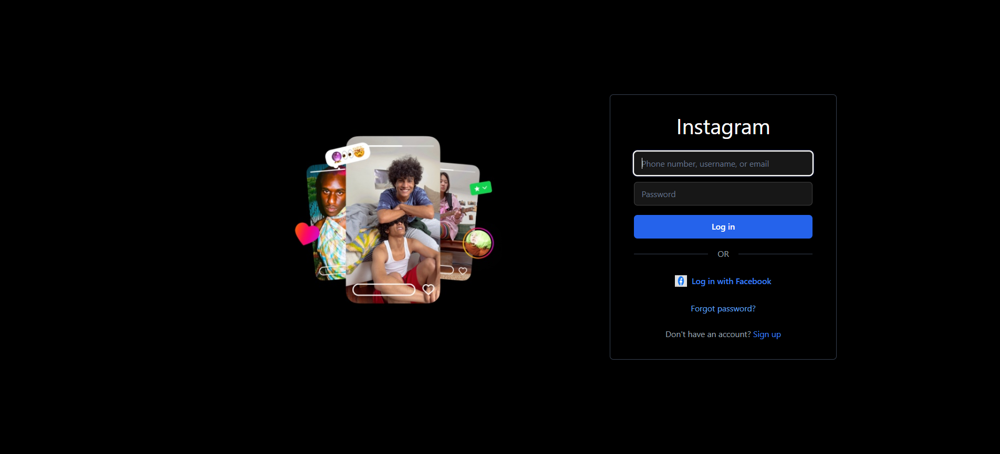
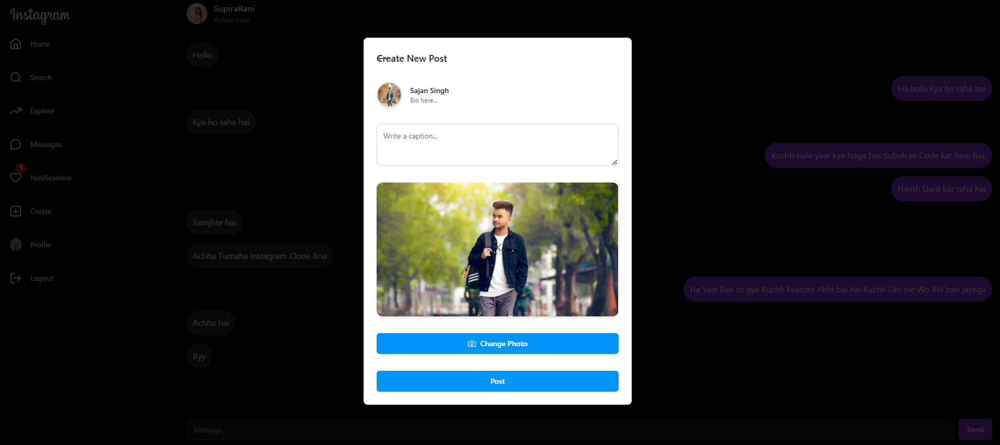
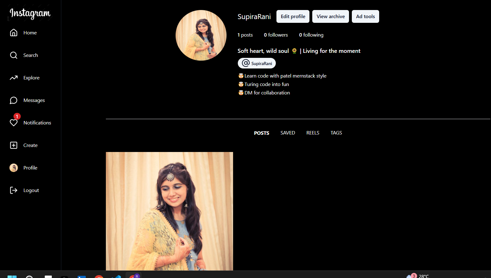

# Convert the given markdown content into a README.md file

## 🖼️ Preview

</hr>






---

# 📸 Instagram Clone

A fully functional **Instagram Clone** built using the modern web stack. This project is inspired by Instagram's sleek design and packed with core features like user authentication, posting, following, and notifications — crafted to give you real-world full-stack experience!

---

## 🚀 Features

- 🔐 User authentication (Register/Login/Logout)
- 📤 Create & upload image posts
- 💬 Comment and like posts
- 👥 Follow / Unfollow users
- 📬 Real-time notifications
- 🔍 Explore and search users
- 🧑‍💻 Fully responsive and mobile-friendly UI

---

## 🛠 Tech Stack

### 🔹 Frontend
- **React.js** – UI development
- **Redux Toolkit** – Global state management
- **Tailwind CSS** – Utility-first styling
- **Lucide Icons** – Beautiful iconography
- **Axios** – API integration

#🔹 Backend
- **Node.js + Express.js** – RESTful API
- **MongoDB + Mongoose** – NoSQL database
- **Cloudinary** – Image upload & storage
- **JWT** – Authentication

---

## 🧑‍💻 Author

Made with ❤️ by **[Rajkumar Verma](https://github.com/PrinceRaj82)**  
Connect with me on [LinkedIn](https://linkedin.com/in/rajkumarprince)  
Check out my full-stack projects on [GitHub](https://github.com/PrinceRaj82)

---

## 📸 Screenshots 

> 📷 Add more screenshots for: Home, Profile, Create Post, Notifications, etc.

---

## 🤝 Want to Contribute?

We welcome all contributions from beginners to experts!

### Steps:
1. Fork this repo 🍴
2. Clone your forked repo locally
3. Create a new branch `git checkout -b feature-branch`
4. Make your changes 🛠️
5. Commit & push `git commit -m "Added feature xyz"`
6. Open a Pull Request 🚀

---

## 🧾 Installation & Setup

```
# Clone the repo

```
git clone https://github.com/your-username/instagram-clone.git

```
cd instagram-clone
# Frontend setup

```
cd frontend
```
```
npm install
npm run dev
```

# Backend setup
```
cd server
```
```
npm install
```
```
npm run dev
